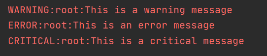
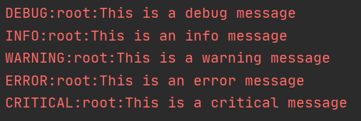
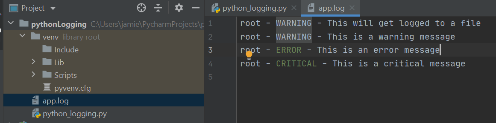
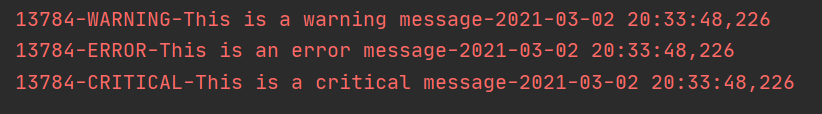
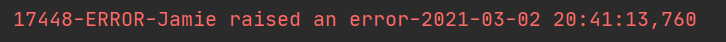
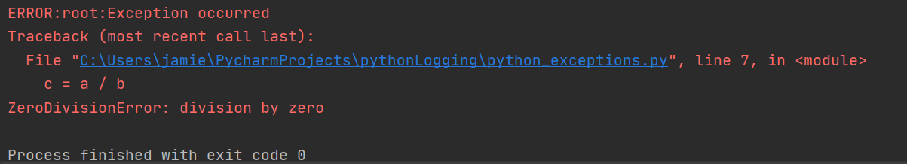
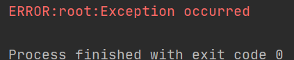

# Logging with Python
- There is an in built logging module that we can make use of
## Severity Levels
 **DEBUG**
 -

 **INFO**
 -

 **WARNING**
 -

 **ERROR**
 -

 **CRITICAL**
 -

## Module's Output
- If we run the following code from our py file
```python
# Logging a message from each level
logging.debug('This is a debug message')
logging.info('This is an info message')
logging.warning('This is a warning message')
logging.error('This is an error message')
logging.critical('This is a critical message')
```  
- We get the following output


- 'root' is the name that the logging module gives to it's default logger
- Format is 'level:name:message'
- By default, the logging module only logs messages that are of Warning level or
 higher (though this can be edited if you wish)
    - This can be done with the `basicConfig(**kwargs)` method
### Basic Configurations
- We briefly mentioned the `basicConfig(**kwargs)` method but we'll dive deeper
into the parameters it takes
- level: set the root logger to this security level
- filename: specify the file
- filemode: file is opened in this mode (default is a for append)
- format: the format of the log message
- So if we change the settings like so
```python
logging.basicConfig(level=logging.DEBUG)
```
- We should now get this output when running the same file


- By using the `filename`, `filemode`, and `format` parameters we can instead
output messages to a file
- We will do this by replacing the previous `basicConfig` line with
```Python
logging.basicConfig(filename='app.log', filemode='w', format='%(name)s - %(levelname)s - %(message)s')
logging.warning('This will get logged to a file')
```
- Which should create a file called app.log and write (or rewrite if the file
    already exists) all logged messages to it with the format we requested
    (name - level - message)


- The reason we had to replace the previous `basicConfig` line is that the root
logger can only be configured once
- Since debug(), info(), warning(), error(), and critical() all call `basicConfig`
with no parameters, we must change the configuration BEFORE any of these calls take place
    - It therefore makes sense to do this at the start of a file
### Formatting the Module's Output
#### Using LogRecord data
- Things already stored in the LogRecord can be added to our outputs very easily
```python
logging.basicConfig(format='%(process)d-%(levelname)s-%(message)s-%(asctime)s')
```
- This will show the process ID that triggered the message along with the time
it was triggered, as can be seen below


#### Using variables
- We can use fstrings to include variables in our messages like so
```Python
name = 'Jamie'
logging.error(f'{name} raised an error')
```


## Combining Logging with Exceptions
- If a logging function is called in an except block that has the `exc_info`
parameter set to True, we can get the full stack trace of an application
```Python
import logging

a = 5
b = 0

try:
  c = a / b
except Exception as e:
  logging.error("Exception occurred", exc_info=True)
```
- Which gives us valuable information as seen below


- As opposed to an unhelpful message seen below if `exc_info` is set to False



- Typing out `exc_info=True` might get tedious if we have to do it every time,
so instead we can just use `logging.exception()` which is just like calling
`logging.error("Exception message", exc_info=True)`
- This logs the message with the error level so if we want a message logged to
a different level we simply call that logging method and set exc_info to True
e.g `logging.critical("Message", exc_info=True)`

## Module's Classes
**Logger**
- Objects of this class will be used to call the functions
**LogRecord**
- These objects are created by Loggers to contain all the information related
to the event being logged
**Handler**
- Handlers send the LogRecord to the required output destination, like the
console or a file. Handler is a base for subclasses like StreamHandler,
FileHandler, SMTPHandler, HTTPHandler, and more. These subclasses send the
logging outputs to corresponding destinations, like sys.stdout or a disk file.
**Formatter**
- Specify a string format that lists out the attributes that the output should
contain
### Creating our own loggers
- To create our own logger we simply use the `logging.getLogger('logger_name')`
function
- If multiple calls are made with the same logger name, each call will refer to
the same object (therefore we don't have to pass the logger around to access it
elsewhere)
- An example logger is made in the code snippet below
```Python
logger = logging.getLogger('example_logger')
logger.warning('This is a warning')
```
### Using Handlers
- If we've created our own logger and want to send the logs to multiple places
we can use Handlers!
- Handlers can send the output to configured destinations e.g stdout, files, via email etc.
- Loggers can have multiple handlers to send the log to multiple locations
- Handlers can also have security levels so that certain levels only send logs
to the console, but more severe levels to be saved to a file
- The code found in the `logging_handlers.py` file does just this and results in
the output below
- Both logs being sent to the console in the StreamHandler's format


- Then just the error being sent to the newly created file in the FileHandler's format


- The name of the logger corresponding to `__name__` is `__main__` in the original file,
but when imported to another python file the name will match the file name you are importing
